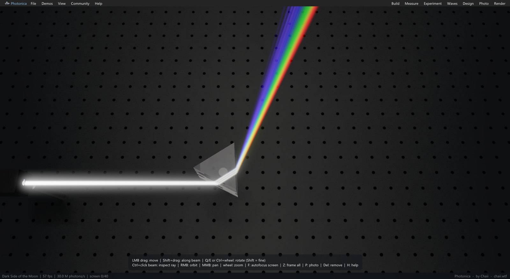
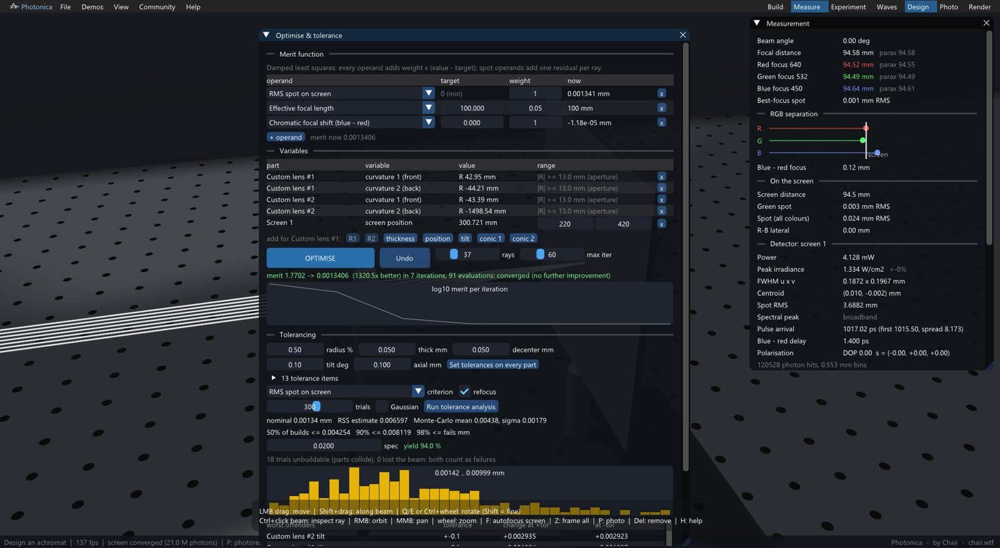
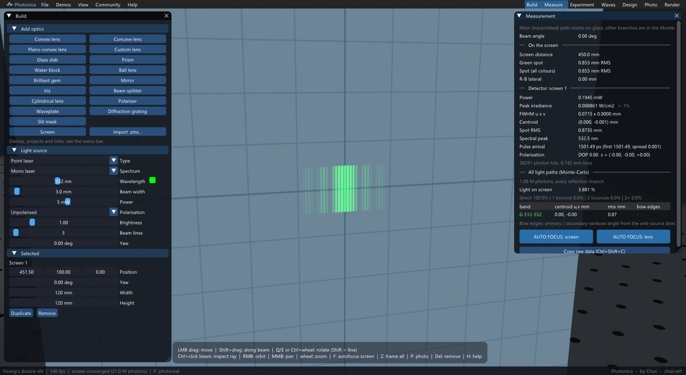
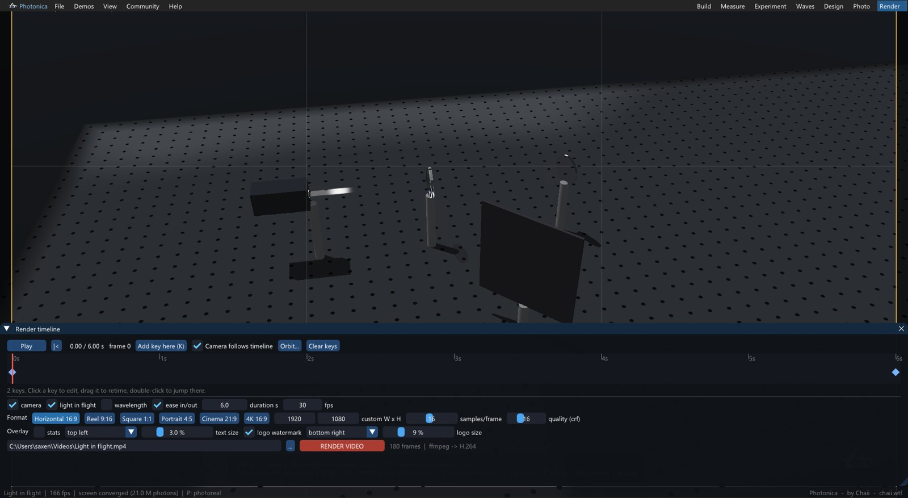
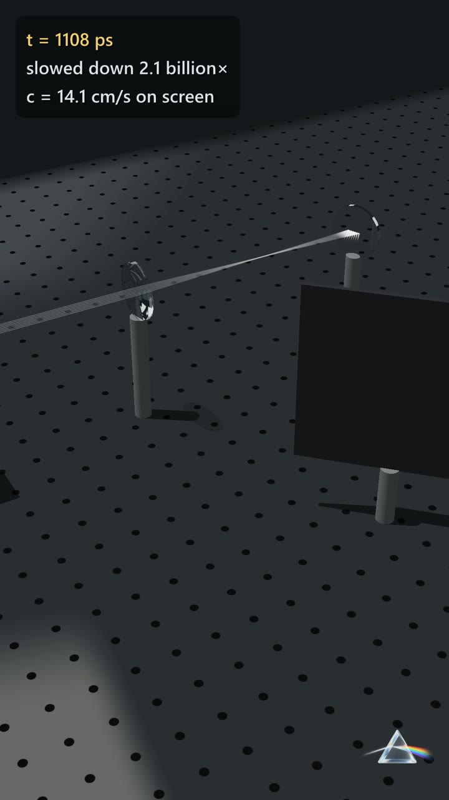

<p align="center"></p>

<h1 align="center">Photonica</h1>
<p align="center">A spectral optics bench: rays, waves, polarisation and time of flight, ray traced on the GPU.<br>
Build laser → glass → screen experiments, measure them like an instrument, design lenses, and render the light in flight.</p>

<p align="center"><a href="https://github.com/cxaiiii/photonica/releases/latest"><b>Download for Windows</b></a> · <a href="community">Community projects</a> · <a href="https://chaii.wtf">chaii.wtf</a></p>



## What it does

- **Real dispersion.** Every ray carries a wavelength. Glasses use manufacturer Sellmeier / Schott data (load any Zemax AGF catalogue), with thermal dn/dT.
- **Measured, not just drawn.** Focal lengths per colour, RMS spot, a detector in mW and W/cm², a Monte-Carlo of every reflection branch, and a ray inspector that lists every surface a ray meets.
- **Waves and polarisation.** Double slits and pinholes computed as Huygens–Fresnel sums, diffraction gratings, polarisers and waveplates (Jones fields, Stokes readout), and PSF / Strehl / MTF.
- **Time of flight.** Group-delay timing on every path. Watch a pulse cross the bench slowed down billions of times, with screens lighting up only when the light actually arrives.
- **Lens design.** A damped-least-squares optimiser (curvatures, thicknesses, spacings, conics) plus sensitivity and Monte-Carlo tolerancing, with collision checks for unbuildable designs. Imports Zemax `.zmx` lens files.
- **Photoreal mode.** A spectral path tracer with caustics, haze and bloom.
- **Video.** A camera timeline with reel (9:16), square, 16:9 and 4K formats, rendered to mp4, with optional burned-in stats and watermark.
- **Assistant control.** An MCP server lets AI assistants build, measure and render with you.
- **Projects and community.** Save benches as `.photonica` files and open shared ones straight from a link or from Community > Browse.

| Lens design & tolerancing | Young's double slit |
|---|---|
|  |  |

| Render timeline (reel format) | Light in flight |
|---|---|
|  |  |

## Works with AI assistants (MCP)

Photonica ships with an [MCP](https://modelcontextprotocol.io) server, `photonica-mcp.exe`, so an assistant like Claude can drive the open app: build and edit benches, read measurements, trace rays, autofocus, optimise and tolerance lenses, take screenshots, and render videos.

```bash
claude mcp add photonica -- "C:\path\to\Photonica\photonica-mcp.exe"
```

For Claude Desktop, add `"photonica": { "command": "C:\\path\\to\\Photonica\\photonica-mcp.exe" }` under `mcpServers`. The connection is local to your PC, and you can switch it off under **View > Allow assistant control**.

## Requirements

- Windows 10 or 11, 64-bit
- A GPU with DirectX Raytracing 1.1: NVIDIA RTX 20-series or newer, AMD Radeon RX 6000 or newer, or Intel Arc
- Optional: [ffmpeg](https://ffmpeg.org) on PATH for mp4 export (`winget install Gyan.FFmpeg`); without it, videos are written as image frames

Unzip and run `Photonica.exe`. Start from the **Demos** menu.

## Community

Anyone can share a bench. In Photonica, use **Community > Share this bench**, or read [community/README.md](community/README.md). Shared benches show up for everyone under **Community > Browse**.

## Feedback

Found a bug or have an idea? [Open an issue](https://github.com/cxaiiii/photonica/issues).

---

Made by **Chaii** · [chaii.wtf](https://chaii.wtf) · © 2026 Chaii, all rights reserved. Photonica is free to download and use; the source is not published.
