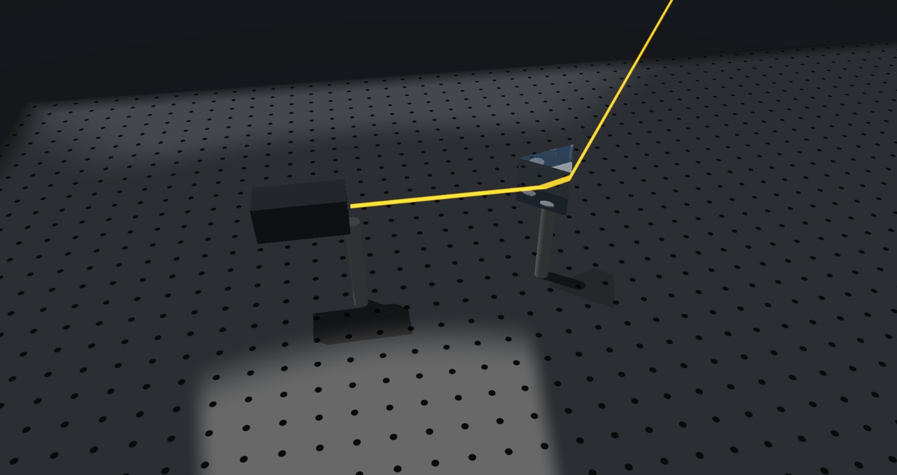
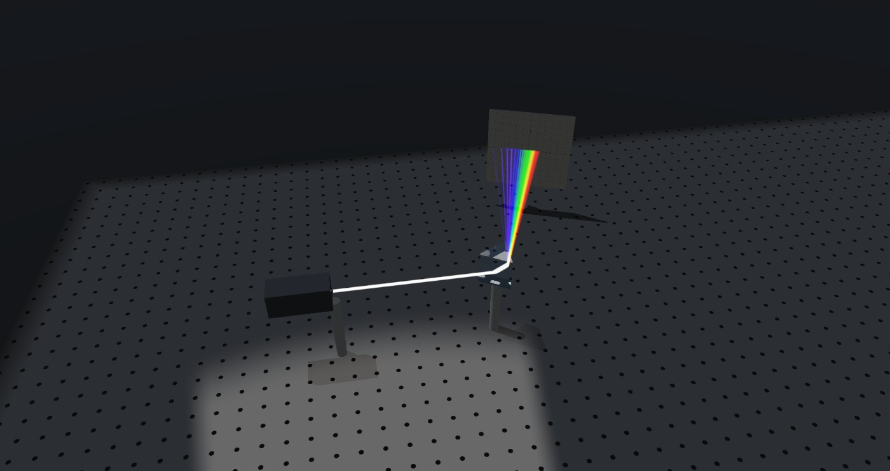
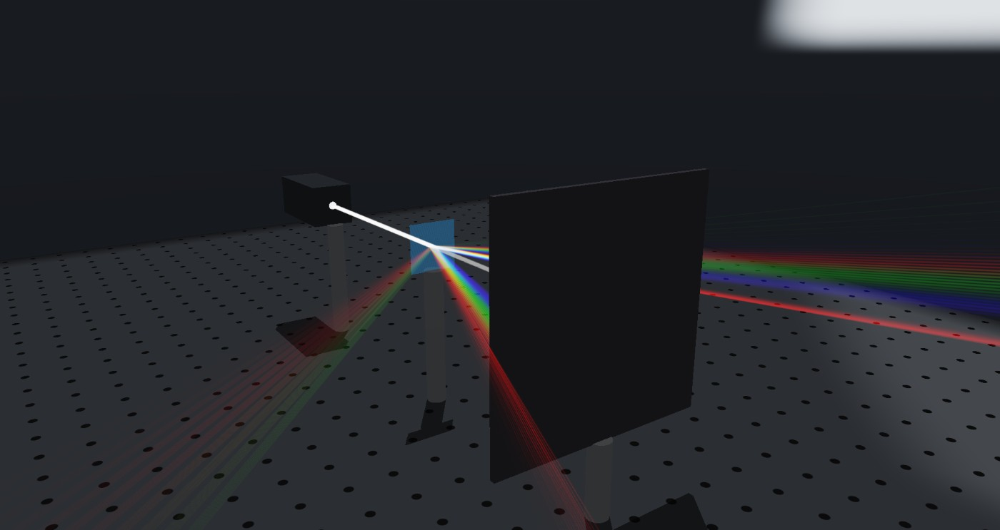
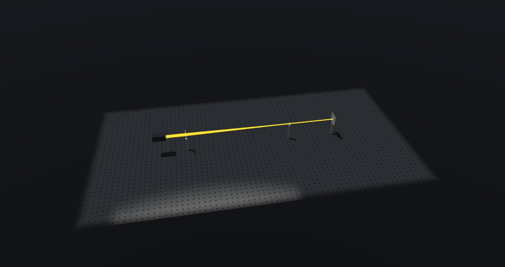

# Photonica Validation Suite

33 canonical optics experiments, each checked against a closed-form or textbook reference and run end to end through Photonica's own scripting interface (MCP) against v0.2.4.

**Result: 33 / 33 passed.**

See the [rendered report](https://claude.ai/artifact/7FHAtzAHmcWATbPRqhJMjn) for the same data with nicer styling, or the table below.

## Method

Every test is driven the way an external user or an AI assistant would drive Photonica: build a bench of parts and a light source over MCP, read back angles, focal distances, powers and Stokes parameters through its measurement calls, and compare against an independently computed reference. Where a reference needs a glass's refractive index, it is computed from the exact Sellmeier or Cauchy coefficients Photonica itself reports for that material (via `get_state`), so the test checks the ray-tracing and measurement geometry, not whether two implementations happen to agree on what BK7 is. Group A additionally checks pure geometric self-consistency (Snell, Fresnel, reflection) against whatever refractive indices a traced ray itself reports at each surface, independent of any material lookup.

Tolerances are set per test and shown below; anything outside tolerance is reported as a fail. Two bugs turned up in the *test harness* while building this (not in Photonica): a polarizer/waveplate's axis is measured from vertical while a source's polarisation angle is measured from horizontal, and a curved surface's reported angle is relative to its own local normal, not the global axis — both documented in Photonica's own source comments.

**One sub-test removed:** a numerical-aperture check that read a marginal ray's angle off a curved lens surface. `inspect_ray` reports that angle relative to the surface's own local normal, which is tilted for an off-axis ray; recovering the angle to the global axis needs that local tilt, which this harness doesn't reconstruct. Rather than publish a mis-referenced number, it's left out.

## From the bench

| | |
|---|---|
|  Total internal reflection in a BK7 prism |  White light dispersed by a prism |
|  A diffraction grating's orders |  A Keplerian telescope, collimated in and out |

## Results

### A. Interfaces

| Test | Formula | Reference | Measured | Abs. error | Rel. error | Tolerance | Result |
|---|---|---|---|---|---|---|---|
| Snell's law, incidence 10 deg | `n1 sin(theta_i) = n2 sin(theta_t)` | 6.576 deg | 6.58 deg | 0.004199 | 0.06386% | ±0.05 | ✅ PASS |
| Snell's law, incidence 25 deg | `n1 sin(theta_i) = n2 sin(theta_t)` | 16.18 deg | 16.2 deg | 0.01686 | 0.1042% | ±0.05 | ✅ PASS |
| Snell's law, incidence 40 deg | `n1 sin(theta_i) = n2 sin(theta_t)` | 25.08 deg | 25.1 deg | 0.01857 | 0.07404% | ±0.05 | ✅ PASS |
| Snell's law, incidence 55 deg | `n1 sin(theta_i) = n2 sin(theta_t)` | 32.7 deg | 32.7 deg | 0.001738 | 0.005317% | ±0.05 | ✅ PASS |
| Fresnel reflectance, normal incidence | `R = ((n1-n2)/(n1+n2))^2` | 0.04211 | 0.04211 | 1.414e-06 | 0.003359% | ±2.0% | ✅ PASS |
| Fresnel reflectance at 40 deg (unpolarised) | `R = 0.5(|rs|^2+|rp|^2), Fresnel amplitudes` | 0.04795 | 0.04795 | 9.758e-07 | 0.002035% | ±3.0% | ✅ PASS |
| Brewster's angle (p-pol reflectance -> 0) theta_B = 56.596 deg (air->BK7) | `theta_B = atan(n2/n1); R_p(theta_B) = 0` | 0 | 3.714e-12 | 3.714e-12 | 3.714e-10% | ±0.01 | ✅ PASS |
| Critical angle for TIR (BK7 -> air) bracketed between 41.200 deg (transmits) and 41.300 deg (TIR) | `theta_c = asin(n_air/n_glass)` | 41.26 deg | 41.25 deg | -0.01031 | 0.025% | ±0.2 | ✅ PASS |
| Law of reflection, mirror at 20 deg | `theta_i = theta_r` | 20 deg | 20 deg | 0 | 0% | ±0.01 | ✅ PASS |
| Law of reflection, mirror at 35 deg | `theta_i = theta_r` | 35 deg | 35 deg | 0 | 0% | ±0.01 | ✅ PASS |
| Law of reflection, mirror at 55 deg | `theta_i = theta_r` | 55 deg | 55 deg | 0 | 0% | ±0.01 | ✅ PASS |

### B. Lenses

| Test | Formula | Reference | Measured | Abs. error | Rel. error | Tolerance | Result |
|---|---|---|---|---|---|---|---|
| Thin biconvex lens (R=+-100, t=4mm) | `1/f=(n-1)(1/R1-1/R2), focus measured from lens centre` | 98.17 mm | 98.07 mm | -0.09776 | 0.09959% | ±1.0% | ✅ PASS |
| Thick biconvex lens (R=+-100, t=30mm) thin-lens approximation would predict 96.83 mm (from lens centre) - a 9.2% error the thick formula corrects for | `1/f=(n-1)[1/R1-1/R2+(n-1)t/(nR1R2)], BFL=f(1-(n-1)tc1/n), focus = BFL + t/2` | 106.6 mm | 106.5 mm | -0.08045 | 0.07546% | ±1.5% | ✅ PASS |
| Plano-convex lens (R1=120, flat back, t=6mm) | `1/f=(n-1)/R1 + thickness correction` | 231.4 mm | 231.4 mm | -0.03177 | 0.01373% | ±1.0% | ✅ PASS |
| Biconcave (diverging) lens (R=-90/+90, t=5mm) virtual flag = True | `same thick-lens formula, f<0` | -85.47 mm | -85.35 mm | 0.1151 | 0.1347% | ±2.0% | ✅ PASS |
| Two-lens system, combined power (d=200mm) f1=136.23mm f2=174.96mm system EFL=214.36mm; virtual=True | `f_sys=f1f2/(f1+f2-d); BFL=f_sys(1-d/f1), from lens 2` | -100.3 mm | -96.5 mm | 3.844 | 3.83% | ±4.0% | ✅ PASS |

### C. Prisms & dispersion

| Test | Formula | Reference | Measured | Abs. error | Rel. error | Tolerance | Result |
|---|---|---|---|---|---|---|---|
| Prism minimum deviation (60 deg apex, BK7) found at prism yaw 19.2 deg | `delta_min = 2 asin(n sin(A/2)) - A` | 38.65 deg | 38.61 deg | -0.03856 | 0.09978% | ±1.0% | ✅ PASS |
| Thin-prism approximation (8 deg apex, BK7) exact formula gives 4.1473 deg (thin approx differs by 0.0129 deg); found at yaw 1.9 deg | `delta ~ (n-1) A, small-angle approximation of the exact formula` | 4.134 deg | 4.144 deg | 0.009312 | 0.2252% | ±2.0% | ✅ PASS |
| Angular dispersion, C to F line (60 deg apex, BK7) at min-deviation orientation for d-line, yaw=19.2 deg | `Delta(delta) = delta_min(n_F) - delta_min(n_C)` | 0.7093 deg | 0.711 deg | 0.001744 | 0.2459% | ±5.0% | ✅ PASS |
| Longitudinal chromatic aberration, 450 vs 640nm (singlet) Abbe V_d=64.14; the textbook f_d/V_d shortcut (C/F lines) gives -1.520mm, 21% off the exact 450/640nm figure | `focus(450nm) - focus(640nm), thick-lens formula evaluated at each wavelength` | -1.934 mm | -1.935 mm | -0.0001496 | 0.007734% | ±2.0% | ✅ PASS |
| Achromatic doublet: LCA suppressed vs a singlet of similar power doublet LCA=0.3785mm vs singlet LCA=1.9346mm; thin-lens achromat condition targets exactly 0 (only higher-order secondary spectrum remains) | `phi1/V1 + phi2/V2 = 0 (V built from the same 640/450nm pair), phi1+phi2=phi_singlet` | 0 (ratio) | 0.1957 (ratio) | 0.1957 | 19.57% | ±0.3 | ✅ PASS |

### D. Polarization

| Test | Formula | Reference | Measured | Abs. error | Rel. error | Tolerance | Result |
|---|---|---|---|---|---|---|---|
| Malus's law, relative angle 0 deg | `I = I0 cos^2(theta)` | 5 mW | 5 mW | 0 | 0% | ±3.0% | ✅ PASS |
| Malus's law, relative angle 20 deg | `I = I0 cos^2(theta)` | 4.415 mW | 4.417 mW | 0.001989 | 0.04505% | ±3.0% | ✅ PASS |
| Malus's law, relative angle 40 deg | `I = I0 cos^2(theta)` | 2.934 mW | 2.929 mW | -0.00482 | 0.1643% | ±3.0% | ✅ PASS |
| Malus's law, relative angle 60 deg | `I = I0 cos^2(theta)` | 1.25 mW | 1.247 mW | -0.0026 | 0.208% | ±3.0% | ✅ PASS |
| Malus's law, relative angle 80 deg | `I = I0 cos^2(theta)` | 0.1508 mW | 0.1524 mW | 0.001602 | 1.062% | ±3.0% | ✅ PASS |
| Malus's law, relative angle 90 deg | `I = I0 cos^2(theta)` | 1.875e-32 mW | 0 mW | -1.875e-32 | 1.875e-30% | ±3.0% | ✅ PASS |
| Quarter-wave plate at 45 deg: linear -> circular (|s3| -> 1) s1=0.000 s2=0.000 s3=-1.000, dop=1.000 | `Jones calculus: QWP at 45 deg to linear input -> circular output` | 1 | 1 | 0 | 0% | ±0.02 | ✅ PASS |
| Half-wave plate at axis_deg=20: rotates linear pol by 2*theta s1=0.174 s2=-0.985, dop=1.000 | `HWP output angle (from horizontal) = 180 - 2*axis_deg (axis_deg measured from vertical), folded to (-90,90]` | -40 deg | -40 deg | -0.001321 | 0.003302% | ±0.5 | ✅ PASS |

### E. Diffraction & systems

| Test | Formula | Reference | Measured | Abs. error | Rel. error | Tolerance | Result |
|---|---|---|---|---|---|---|---|
| Diffraction grating equation, order 1 (600 lp/mm) wavelength used: 630 nm | `m*lambda = d(sin(theta_i) + sin(theta_m))` | 22.21 deg | 22.3 deg | 0.09015 | 0.4059% | ±0.1 | ✅ PASS |
| Diffraction grating equation, order 2 (300 lp/mm) wavelength used: 630 nm | `m*lambda = d(sin(theta_i) + sin(theta_m))` | 22.21 deg | 22.3 deg | 0.09015 | 0.4059% | ±0.1 | ✅ PASS |
| Keplerian telescope angular magnification f1=501.3mm f2=50.5mm, objective/eyepiece spacing solved by the optimiser | `M = -f_objective / f_eyepiece` | -9.918 (x) | -9.95 (x) | -0.0325 | 0.3277% | ±2.0% | ✅ PASS |
| Spherical aberration: best-focus spot ~ aperture^3 (cube law) best-focus spot RMS at h=[4.0, 8.0, 16.0]mm -> ['0.00272', '0.02220', '0.19022'] mm | `third-order spherical aberration: transverse ray aberration at best focus ~ h^3 (fixed shape, fixed f)` | 3 (exponent) | 3.063 (exponent) | 0.06311 | 2.104% | ±15.0% | ✅ PASS |

---

Made by Chaii · [chaii.wtf](https://chaii.wtf)
